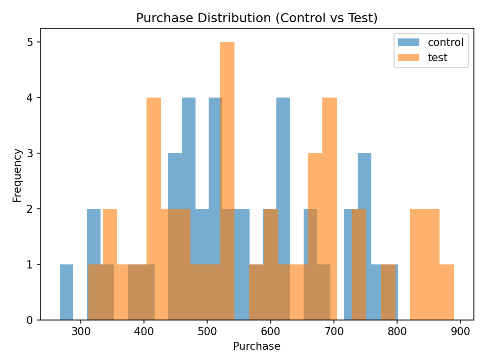
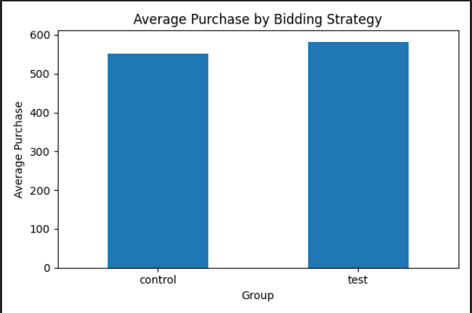

# A/B Testing: Maximum Bidding vs Average Bidding

## 📌 Project Overview
This project analyzes an A/B test conducted to compare two Facebook ad bidding strategies:
**Maximum Bidding** (control group) and **Average Bidding** (test group).

The goal is to determine whether the newly introduced **Average Bidding** strategy leads to a statistically and practically significant improvement in **Purchase** conversions.

---

## 🧠 Business Problem
Facebook introduced **Average Bidding** as an alternative to **Maximum Bidding**.  
A company (bombabomba.com) ran a **1-month A/B test** to evaluate whether the new bidding strategy improves conversion performance.

The primary success metric is **Purchase**, representing completed purchases after ad clicks.

---

## 📊 Dataset
- **Source:** `ab_testing.xlsx`
- **Sheets:**
  - Control Group → Maximum Bidding
  - Test Group → Average Bidding
- **Observations:** 40 per group

### Features
| Feature | Description |
|-------|------------|
| Impression | Number of ad impressions |
| Click | Number of ad clicks |
| Purchase | Number of purchases |
| Earning | Revenue generated |

---

## 🧪 Methodology
The analysis follows a structured A/B testing workflow:

1. **Data Quality Checks**
   - Shape, missing values, data types  
2. **Exploratory Analysis**
   - Purchase means by group  
3. **Assumption Checks**
   - Shapiro-Wilk test (normality)
   - Levene test (variance homogeneity)  
4. **Hypothesis Testing**
   - Independent two-sample t-test (parametric)  
5. **Advanced Statistics**
   - Effect size (Cohen’s d)
   - Post-hoc power analysis  
6. **Business Recommendation**

---

## 📐 Hypotheses
- **H0:** The average Purchase of control and test groups are equal.
- **H1:** The average Purchase of control and test groups are different.

---

## 📈 Key Results
- **Purchase Mean**
  - Control: 550.89
  - Test: 582.11
- **p-value:** 0.3493 → *Not statistically significant*
- **Effect Size (Cohen’s d):** 0.21 → *Small effect*
- **Power:** 0.15 → *Low statistical power*

---

## ✅ Conclusion
No statistically significant difference was detected between the two bidding strategies.  
Although the test group shows a slightly higher average Purchase, the effect size is small and the experiment is underpowered.

---

## 💡 Recommendation
- Maintain the current bidding strategy.
- Re-run the experiment with a **larger sample size** or **longer duration**.
- Perform **segment-based analysis** (device, user type, category) before making a final decision.

---

## 🛠️ How to Run the Project

```bash
pip install -r requirements.txt
python ab_testing_analysis.py

## 📊 Visual Results

### Purchase Distribution


### Mean Purchase Comparison

